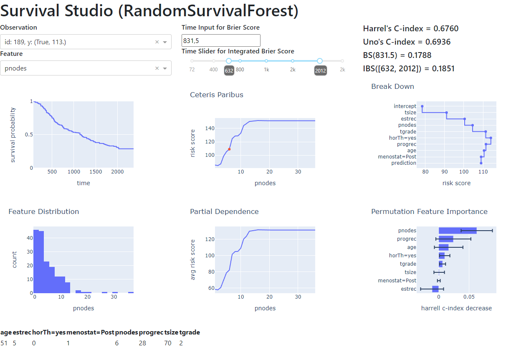

# Survival Studio

Survival Studio is a tool for automatic and interactive exploration of complex survival models. It is designed to be fully compatible with the [`scikit-survival`](https://scikit-survival.readthedocs.io/en/stable/) package.

Preview:

See the live example [here](https://survivalstudio.pythonanywhere.com/)!
