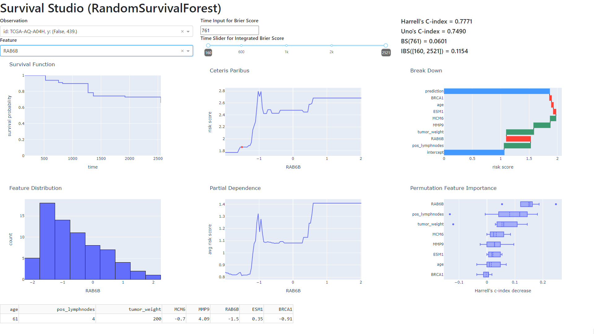

# Survival Studio

Survival Studio is a tool for automatic and interactive exploration of complex survival models. It is designed to be fully compatible with the [`scikit-survival`](https://scikit-survival.readthedocs.io/en/stable/) package.

Preview:

See the live example [here](https://survival-studio.onrender.com)!

Note: Please be patient for the first time. The Render hosting service shuts down the application after a certain period of inactivity and it takes some time to restart it again (usually 1-2 minutes).

If you want to run it locally (faster option, requires Python>=3.7.10) then install `requirements.txt` and run `main.py` script with default setup or make your own example.
